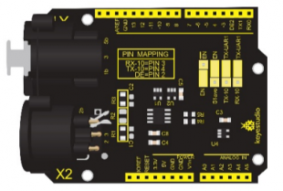
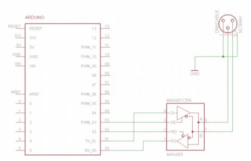
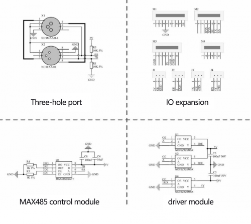
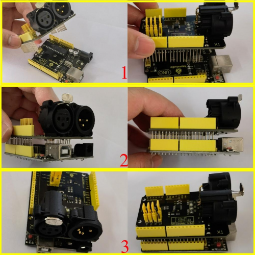
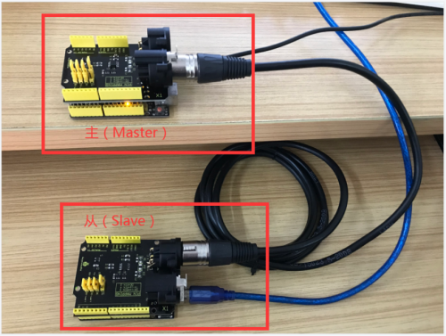
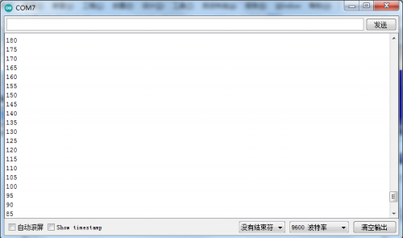

# KS0529 Keyestudio DMX（RDM）Shield

## 1. Description

This DMX(RDM) shield is designed for Arduino. Its working voltage is 5V and has 0.5W power consumption.

It can transmit and receive DMX through Arduino so as to control speakers, light and smoke machine. If you get tired of the programming language, you also can use C language with the DMX（RDM）shield.



## 2. Working Principle

DMX（RDM）shield communicates via DMX. It can serve as the Master or Slave when you treat Ardunio as the controller of DMX. DMX shield is an add-on for the Arduino and the MAX485 chip can drive the circuit.

DMX library is based on the USART library, which indicates TX and RX serial communication are applied. When the port of Arduino is connected to MAX485, the DMX device can communicate with Arduino.



## 3. MAX485 Chip Schematic Diagram



## 4. Connection Diagram



Test Result Prepare two Arduino control boards and two DMX shields and a three-hole connection wire. Code：Max485_Master.ino and Max485_Slave.ino

Insert this shield onto the Arduino board which has programmed the test code Max485_Master.ino Then insert the another shield onto another Arduino board which has programmed the test code Max485_Slave.ino



Then open the monitor of Arduino, you will view numbers become from larger to smaller then larger.



## 5. Arduino serial monitor

Test Code 1：

```c
Max485_Master.ino

int enablePin = 2;  
int brightness = 0;    //define the variable brightness and its initial value, which is used to indicate the LED brightness
int fadeAmount = 5;    //define the variable fade Amount which is used to indicate the decrement
int Pwm_pin = 9;

void setup()
{
  Serial.begin(9600);            // initialize serial at baud rate 9600:
  pinMode(enablePin, OUTPUT);
  pinMode(Pwm_pin,OUTPUT); 
  delay(10); 
  digitalWrite(enablePin, HIGH);  //  (always high as Master Writes data to Slave)
}

void loop()
{
  analogWrite(Pwm_pin, brightness);//write the value of brightness to the port 9
  brightness = brightness + fadeAmount;//change the value of brightness to alter in the next circulation
  Serial.println(brightness); 
  if (brightness == 0 || brightness == 255) 
  {
    fadeAmount = -fadeAmount ; 
  }     
  
  delay(30); //delay in 30ms
}
```

Test Code 2：

```c
Max485_Slave.ino

int enablePin = 2; 
int ledpin = 13;

void setup() 
{
  Serial.begin(9600);                   // initialize serial at baud rate 9600:
  pinMode(ledpin,OUTPUT);
  pinMode(enablePin, OUTPUT);
  delay(10);
  digitalWrite(enablePin, LOW);        //  (Pin 8 always LOW to receive value from Master)
  
}

void loop() 
{                                                  
  while (Serial.available())                   //While have data at Serial port this loop executes
  {           
     int pwmval = Serial.parseInt();            //Receive INTEGER value from Master throught RS-485
     int convert = map(pwmval,0,1023,0,255);    //Map those value from (0-1023) to (0-255)
     analogWrite(ledpin,convert);               //PWM write to LED                        //Displays the PWM value
     Serial.println(pwmval);
     delay(30);
    }
}
```

## 6. Test Result

Prepare two Arduino control boards and two DMX shields and a three-hole connection wire. Code：Max485_Master.ino and Max485_Slave.ino

Insert this shield onto the Arduino board which has programmed the test code Max485_Master.ino Then insert the another shield onto another Arduino board which has programmed the test code Max485_Slave.ino

Then open the monitor of Arduino, you will view numbers become from larger to smaller then larger.